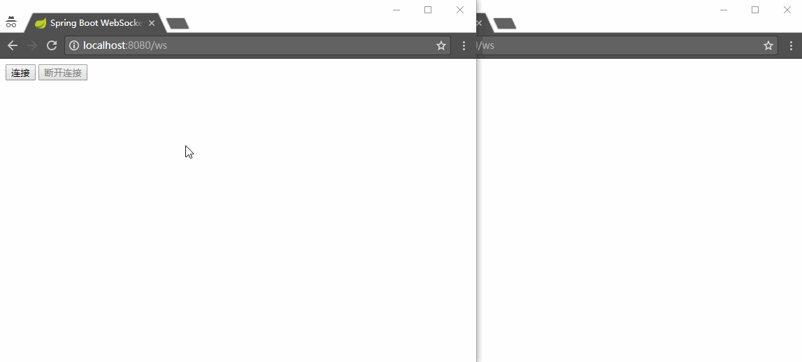

# Spring Boot WebSocket And Android Client

Spring Boot WebSocket Server, with a browser client and Android client. Android client uses [StompProtocolAndroid](https://github.com/NaikSoftware/StompProtocolAndroid) which implements STOMP on Android, to subscribe or send message to server.

## Intro

Server now include two endpoints to receive message from client:

- `/welcome`
- `/group/{groupID}`

For endpoint `/welcome`, when a message received, the server will transfer it to all subscribers for `/topic/getResponse`.

For endpoint `/group/{groupID}`, before sending a message, client can specify the `groupID`, and the message will only be transfered to who subscribe `/topic/group/{groupID}`. The two `groupID` is the same value, also you can choose to use a different value by changing the [controller code](WebSocketServer/src/main/java/me/xlui/im/web/WebSocketController.java).

Android client now can only send message to endpoint `/welcome`, support for endpoint `/group/{groupID}` is the next feature.

Browser client can send message to all endpoints, just see the GIFs bellow. 

## Server

## Browser

## Android

## Dynamic Groups

## LICENSE

MIT
